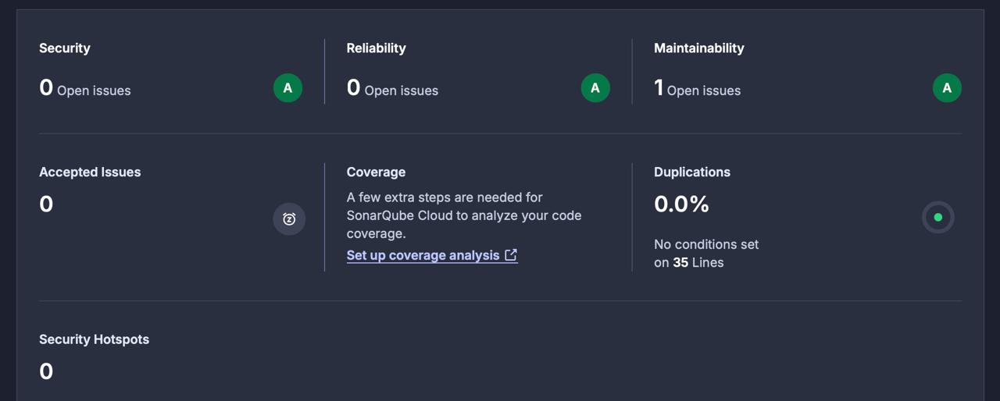
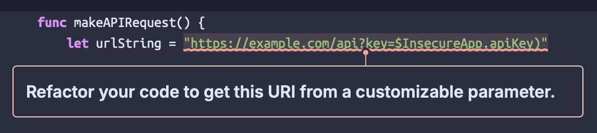

# Анализ найденных уязвимостей

## Использованные инструменты

- Язык: Swift
- Статический анализатор: SonarQube

## SonarQube нашел 1 уязвимость

1. Статическая конкатенация строки с апи-ключом
- Тип: Improper API Key Handling
- Критичность: Средняя
- Рекомендации: Использовать Keychain

## Дополнительные уязвимости

2. Пароль захаркожен
- Тип: Hardcoded secrets
- Критичность: Высокая
- Рекомендации: Использовать Keychain

3. Ошибка в интерполяции URL
- Тип: Input Validation
- Критичность: Средняя
- Рекомендации: Использовать корректную интерполяцию строки в строку для языка Swift

4. Примитивная аутентификация
- Тип: Broken Authentication
- Критичность: Высокая
- Рекомендации: Использовать хэширование, серверную проверку
